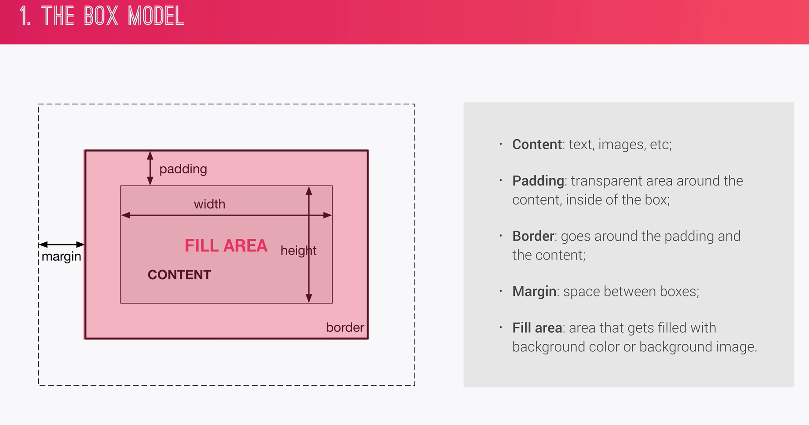
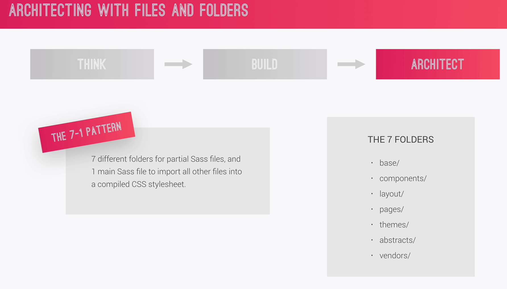

# Advanced CSS Practice

### There are three pillars to write good HTML and CSS
- Responsive design
    * Fluid Layouts
    * Media Queries
    * Responsive images
    * Correct units
    * Desktop-first vs mobile-first

- Maintainable and Scalable code
  * Clean
  * Easy-to-understand
  * Growth
  * Reusable for other developers
  * How to organize files (need to think about css architecture)
  * How to name classes
  * How we structure or markup in HTML

- Web Performance
  * Making an app more performant means to make it faster and smaller in size so that user has to download less data
  * Less HTTP requests
  * Less code
  * Compress code
  * Use a css preprocessor
  * Less images
  * Compress images

### What Happens to CSS when we load a Webpage

When the browser loads a HTML file, it then takes then loaded html code and parses it which means it decodes it line by line. From this process, the browser builds DOM which describes the entire web document like a family tree with parents and children and sibling elements. This DOM is where the entire decoded HTML code is stored.

When the browser parses html, it also finds the stylesheets included in the html head and starts loading them and hence css is parsed.

The parsing of CSS is a bit complex. Follows two main steps:

1. Resolving Confilicting CSS Declarations (cascade)
    - cascade is the process that is used to resolve conflict
2. Process final CSS values
    - Like converting margin unit from percentage to pixels

The final CSS is also stored in a tree-like structure known as CSS Object Model (CSSOM) like DOM. In order to have html and css parsed ans stored. In order to render page, the browser uses the **visual formatiing model** like box-model (floats, positioning).

Finally, the visual formatting model has done its work, the website is finally rendered.

#### CSS Rule
- Selector and a declaration block
- Declaration block consits of property and its value

#### The Cascade (The C in CSS)
- Cascade is the process of combining different stylesheets and resolving conflicts between different CSS rules and declarations, when more than one rule applies to a certain element. (like font-size property can appear in several stylesheets plus several times in one single stylesheet)

- CSS can come from different sources, the most common is the one we developers write that's **AUTHOR** declarations
- USER decalrations (if the user changes thes the defauly font-size of the browser)
- BROWSER (user Agent) Declarations (the default which is not set by the author like anchor tags will show blue by default)

Thus the cascade combines all the CSS declarations coming from different sources

#### How the Cascade resolves confilct when more than one rule applies
- Importance (weight)

    * `!important` keyword overwrites (User) (have the highest priority but should be used as the last resource, it's better to figure out specificity to make the code more maintainable)
    * `!important` keyword overwrites (Author)
    * Author declarations
    * User declarations
    * Default browser declarations

- Specificity (thus deciding which one takes presidence)

    * Inline styles 
    * IDs
    * Classes, pseudo-classes, attribute
    * Elements, pseudo-elements


- Source Order
    * The last declaration in the code will override all other declarations and will be applied.
    * Rely more on **specificity** than on the **order** of selectors (best practice, easy to rearrange)
    * However, when using extenal third party style sheets, so put the author stle sheet at the last in the html  

### How CSS is Parsed (Value Processing)

**How CSS Values are Processed**
 
 - `rem` is a relative unit which is always relative to the root font-size which is `16px` by default 

 **Inheritance**

 - The child element inherits the style properties from the parent element

 

 - Using `em` and `rem` results in more robust responsive layouts

 - `vh` is 1% of viewport height
 - `vw` is 1% of viewport width

 

 - Each property has an initial value, if nothing is declared
 - Browsers specify a **root font-size** for each page (usually 16px)
 - Percentage and relative values are always converted to pixels 

  ### Inheritance

  Inheritance is a way of  propagating property values from parents elements to children (More maintainable code)

  - Each and every CSS property must have a CSS value
  - If there's a cascaded value, then the specified value equals the cascaded value
  - If not then whether or not the property can be inherited, if yes then the specified value of that propervty equals the computed value of the parent element
  - Remember it's computed value not the actual value

  

  - Properties related to text are usually inherited such as `font-family` `font-size` `color` not like `padding` `margin`

  - The `inherit` keyword forces inheritance on a certain property

  - The `initial` keyword resets a property to its initial value

#### Why `rem` over `px`? 

### CSS Visual Formatting Model

- Box Model




- Box Sizing


- Types of Bozxes


- Box Positioning


- Stacking Contexts


### CSS Architecture , Components and BEM




### SASS


**Note** When you apply float to elements, it loses its height

Codepen: https://codepen.io/anon/pen/eGZKyY?editors=1100

```html
<nav>
  <ul class="navigation">
    <li><a href="#">About us</a></li>
    <li><a href="#">Pricing</a></li>
    <li><a href="#">Contact</a></li>
  </ul>
  <div class="buttons">
    <a class="btn-main" href="#">Sign up</a>
    <a class="btn-hot" href="#">Get a quote</a>
  </div>
</nav>
```

```css
    .clearfix::after {
    content: "";
    clear: both;
    display: table;
  }

  /*OR*/

  nav {
      margin: 30px;
      background: blue;

      &::after {
        content: "";
        clear: both;
        display: table;  
      }
  }
  ```

- `%btn-placeholder` is for placeholder
- `@extend btn-placeholder` to apply in cs property
- `@mixin mixin-name(args)` for mixins
- `@include mixin-name` to include in a css property


### Install Sass

- `node -v`
- `npm init -y`
- `npm install node-sass --save-dev`
- `npm install jquery --save` incase to uninstall

Difference between dependencies and dev dependencies?

### Compile SASS
- Make changes to the scripts in package.json file
```
"scripts": {
    "compile:sass": "node-sass sass/main.scss css/style.css"
  },
  ```
  - Run the following command on the Terminal `npm run compile:sass`
  - In order to avoid rrunning the command everytime we make changes in the sass file, we can add `watch` to `package.json`
  ```
"scripts": {
    "compile:sass": "node-sass sass/main.scss css/style.css -w"
  },
  ```

#### Install live-server

- `npm install live-server -g` OR `sudo npm install live-server -g`
- `live-server` TADA!!
- No re-loading required

### Pseudo Elements

